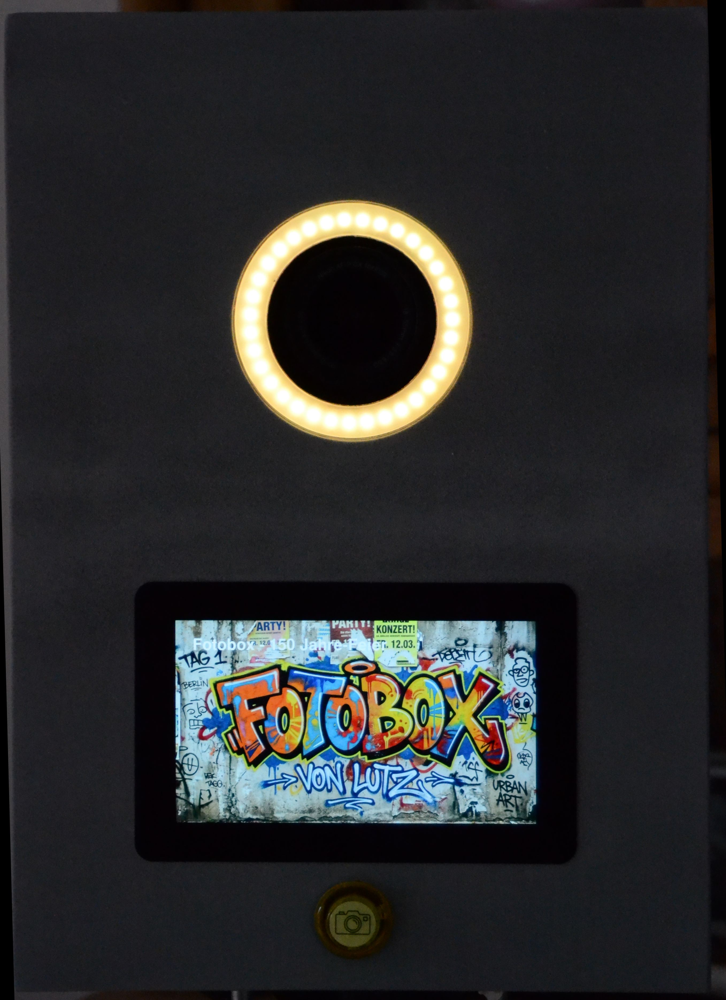
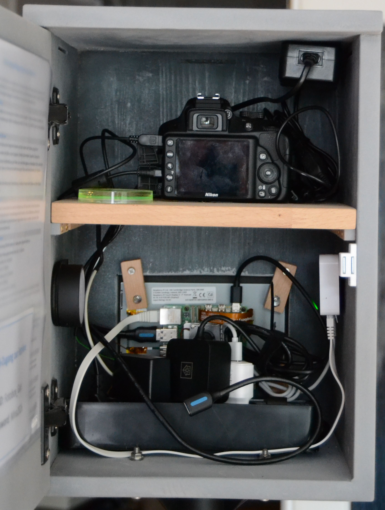
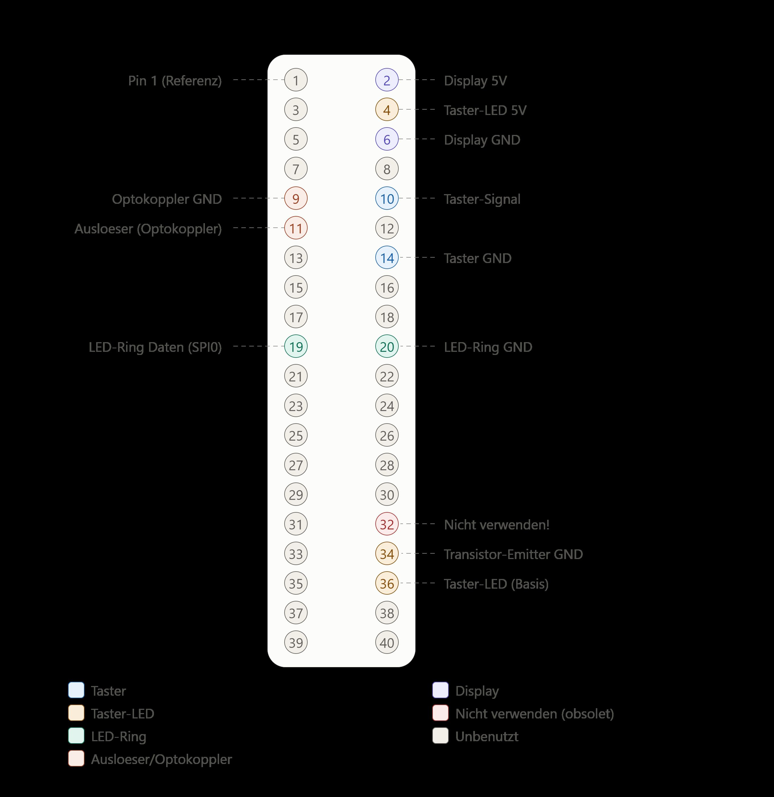
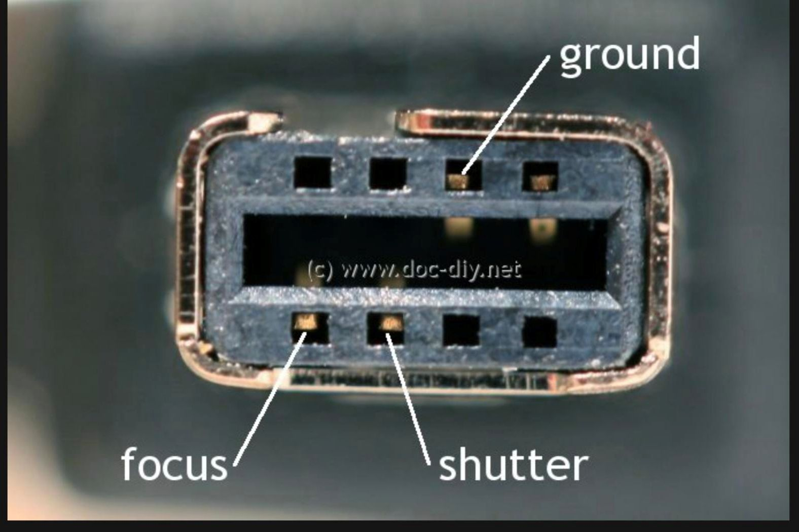

# Fotobox

Eine Raspberry-Pi-5-basierte Fotobox für Events. Python/pygame-App mit
sauberer State-Machine-Architektur, Nikon-D3300-Kamera (gphoto2), WS2812-
LED-Ring, beleuchtetem Auslöse-Taster, Touch-Display und Optokoppler-
Kameraauslösung.

Die App läuft im Vollbild auf einem angeschlossenen Touch-Display, führt
Gäste per Countdown durch die Aufnahme, zeigt das Ergebnis zur
Bestätigung/Löschung an, exportiert gespeicherte Fotos für den QR-Code-
Download und zeigt zwischendurch eine "Fliegende Galerie" bereits
aufgenommener Fotos als Blickfang.

> Aktuell im Einsatz für private Veranstaltungen (u. a. eine 150-Jahre-
> Feier und eine Familienfeier). Alle UI-Texte und Code-Kommentare sind
> auf Deutsch.

## Inhaltsverzeichnis

- [Funktionsumfang](#funktionsumfang)
- [Hardware](#hardware)
- [Architektur](#architektur)
- [Projektstruktur](#projektstruktur)
- [Installation auf dem Raspberry Pi](#installation-auf-dem-raspberry-pi)
- [Konfiguration](#konfiguration)
- [Autostart](#autostart)
- [Verstecktes Herunterfahren](#verstecktes-herunterfahren)
- [Netzwerk-Setup](#netzwerk-setup)
- [Backup](#backup)
- [Tests](#tests)
- [Bekannte Einschränkungen & Learnings](#bekannte-einschränkungen--learnings)
- [Entwicklungs-Workflow](#entwicklungs-workflow)
- [Sicherheit / Härtung](#sicherheit--härtung)
- [Datenschutz](#datenschutz)

## Funktionsumfang

- Geführter Aufnahme-Ablauf: Hauptmenü → Countdown → Aufnahme → Vorschau
  (Speichern/Verwerfen) → QR-Code zum Download
- Live-Vorschau der Kamera vor der Aufnahme (gphoto2 `capture_preview`)
- Farbige LED-Choreografie über einen `LedEffect`-Enum pro `AppState`
  (Sternenhimmel-Idle-Animation, Kometen-Effekte, Countdown-Ring u. a.)
- Beleuchteter Hardware-Auslöse-Taster (synchron zur LED-Ring-Choreografie)
- Galerie mit Grid- und Vollbild-Ansicht, Lösch-Bestätigung mit Timeout
- "Fliegende Galerie" (Attract-Mode): zeigt zufällig bereits aufgenommene
  Fotos an, mit gelegentlich eingestreutem Werbe-Wallpaper
- QR-Code-Anzeige zum Download des eigenen Fotos über das lokale Netzwerk
- DSGVO/GDPR-Hinweis als eigener, scrollbarer Bildschirm (`TERMS`)
- Touch- und Hardware-Button-Bedienung, Swipe-Gesten in der Galerie
- Automatischer Neustart bei Absturz (`start_fotobox.sh`)
- Verstecktes Herunterfahren per Geheim-Geste + PIN (ohne Tastatur/SSH),
  mit Sonnenuntergangs-Animation am LED-Ring
  (siehe [Verstecktes Herunterfahren](#verstecktes-herunterfahren))

## Hardware

| Komponente | Details |
|---|---|
| Rechner | Raspberry Pi 5 |
| Kamera | Nikon D3300, Ansteuerung über `gphoto2`/USB |
| LED-Ring | WS2812, 35 LEDs, SPI0 (`neopixel_spi`) |
| Display | Kapazitives Touch-Display (Goodix), DSI-2, physisch 90° gedreht |
| Auslöse-Taster | Beleuchtet, Ansteuerung über Transistor |
| Kamera-Auslösung | Optokoppler (PC817) an Nikon MC-DC2-Buchse |

<p align="center">
  
  
</p>
<p align="center">
  
</p>

### GPIO-Pin-Tabelle (autoritativ)

| Pin | GPIO | Funktion |
|---|---|---|
| 10 | GPIO15 | Taster-Signal (Eingang, Pull-up) |
| 14 | GND | Taster-Rückleitung |
| 11 | GPIO17 | Auslöser/Optokoppler (aktiv LOW) |
| 9 | GND | Optokoppler-Rückleitung |
| 19 | GPIO10 | LED-Ring-Daten (SPI0 MOSI, `neopixel_spi`) |
| 20 | GND | LED-Ring |
| 36 | GPIO16 | Taster-LED (Transistor-Basis, 1 kΩ) |
| 34 | GND | Transistor-Emitter |
| 4 | 5V | Taster-LED-Anode |
| 2 | 5V | Display |
| 6 | GND | Display |

> **Wichtig:** Der LED-Ring läuft über SPI0/GPIO10 (Pin 19,
> `neopixel_spi`) — **nicht** über GPIO12/Pin 32 (PWM/`rpi_ws281x`). Das
> war eine frühere Planung und ist obsolet.

### Wichtige Kamera-Einstellungen (Nikon D3300)

<p align="center">
  
</p>

- Modus: M (Manuell)
- Fokus: MF (manuell, einmalig eingestellt)
- LiveView: EIN
- Auto-Off/Energiesparen: AUS
- Bildformat: JPEG (Fine)

Die Kamera deaktiviert HDMI-LiveView, sobald USB angeschlossen ist
(Firmware-Verhalten, nicht softwareseitig umgehbar). Die Live-Vorschau
läuft deshalb ausschließlich über `gphoto2.capture_preview()` per USB
(~640×424 JPEG-Frames, ~8 fps). Download und Live-Vorschau teilen sich
ein `threading.Lock`, da `gphoto2` nur eine aktive Kamera-Verbindung
gleichzeitig erlaubt.

## Architektur

Unidirektionaler Datenfluss nach dem Muster
`AppModel` → `StateMachine` → `TransitionResult`:

```
Event (Touch/Taster/Timer)
        │
        ▼
   StateMachine.transition(model, event, now)
        │
        ├── neues AppModel (state, session, ui, timers)
        └── Actions (Strings, z.B. "delete_photo", "export_photo")
        │
        ▼
   app_with_hw.py: Actions ausführen, Hardware ansteuern
        │
        ▼
   renderer.py: aktuellen State auf das Display zeichnen
```

Layout, Rendering, Event-Handling und Hardware-Abstraktion sind bewusst
in getrennte Module aufgeteilt (siehe [Projektstruktur](#projektstruktur)).
Die eigentliche Ablauflogik (`state_machine.py`) kennt keine Hardware-
Details — Hardware-Zugriffe stecken ausschließlich in den `hw_*`-Modulen.

### Zustände (`AppState`)

`BOOT → MAIN_MENU → ATTRACT_GALLERY / GALLERY_GRID / GALLERY_FULLSCREEN /
PHOTO_INTRO → PHOTO_PREVIEW → COUNTDOWN → CAPTURE_PENDING → REVIEW →
DELETE_CONFIRM → QR_DISPLAY`, außerdem `INSTRUCTIONS`, `TERMS`,
`ERROR_SCREEN`, `MAINTENANCE` sowie `PIN_ENTRY` und `SHUTDOWN_GOODBYE`
für das [versteckte Herunterfahren](#verstecktes-herunterfahren).

## Projektstruktur

| Datei | Zweck |
|---|---|
| `app_with_hw.py` | Einstiegspunkt, Event-Loop, Hardware-Wiring, Action-Ausführung |
| `state_machine.py` | Zustandsübergänge, reine Logik ohne Hardware-Bezug |
| `states.py` / `events.py` | `AppState`- und `EventType`-Enums |
| `models.py` | `AppModel`, `TimerState`, `SessionState`, `UiState` |
| `renderer.py` | Zeichnet den aktuellen State auf das Display (pygame) |
| `layout.py` | Layout-Konstanten/Bounding-Boxes für Buttons & Elemente |
| `config.py` | Zentrale Konfiguration (`AppConfig` und Unter-Configs) |
| `led_service.py` / `hw_led_provider.py` | LED-Choreografie (Enum-Pipeline) und SPI-Ansteuerung |
| `led_shutdown.py` | Sonnenuntergangs-Animation des LED-Rings beim Herunterfahren (hardwarefreie `frame_colors(t)`) |
| `shutdown_service.py` | Verstecktes Herunterfahren: Geheim-Geste-Erkennung + PIN-Sperre (reine Logik, keine Hardware) |
| `hw_button_provider.py` | GPIO-Taster inkl. Taster-LED-Sync |
| `hw_capture_provider.py` | Kameraauslösung (GPIO/Optokoppler) + gphoto2-Download |
| `hw_gphoto2_preview_provider.py` | Live-Vorschau per gphoto2 |
| `hw_grabber_provider.py` | (nicht mehr verwendet — HDMI-Grabber-Ansatz wurde verworfen) |
| `camera_capture.py` / `camera_preview.py` | Provider-Protokolle/Wrapper |
| `fake_capture_service.py` / `fake_preview_service.py` | Fixture-basierte Provider für Entwicklung ohne Hardware |
| `gallery_service.py` | Foto-Listing, Thumbnail-/Vollbild-Cache, Löschen |
| `storage_service.py` | Export ins Web-Verzeichnis, Datei-Operationen |
| `qr_service.py` | QR-Code-Erzeugung für den Foto-Download |
| `button_service.py` | Hilfslogik für Taster-Events |
| `start_fotobox.sh` | Autostart-Skript mit Neustart-Schleife |
| `test_*.py` | Unit-Tests (pytest) |

## Installation auf dem Raspberry Pi

```bash
# Systempakete
sudo apt update
sudo apt install python3-gphoto2 libgphoto2-6 -y

# Python-Abhängigkeiten (mit sudo installieren, da app_with_hw.py mit
# sudo läuft und sonst KEINE user-lokalen ~/.local-Pakete sieht!)
sudo pip3 install gphoto2 neopixel_spi qrcode pillow pygame --break-system-packages
```

Bekannter Konflikt: `gvfs-gphoto2-volume-monitor` blockiert den
`gphoto2`-Zugriff. Wird von `hw_capture_provider.py` beim Start
automatisch beendet (`kill_gvfs()`); alternativ per systemd-Unit dauerhaft
deaktivieren.

### Berechtigungen

Nur `app_with_hw.py`, `hw_led_provider.py`, `hw_button_provider.py` und
`hw_capture_provider.py` benötigen zur Laufzeit `sudo` (GPIO-/SPI-
Hardwarezugriff). Reine Logik-Module werden nie direkt ausgeführt.

`nginx` muss als `user photobox;` laufen (nicht `www-data`), sonst gibt
es 403-Fehler auf Dateien unter `/home/photobox/`.

## Konfiguration

Zentrale Einstellungen in `config.py` (`AppConfig` und Unter-Configs
`ScreenConfig`, `TimeoutConfig`, `FeatureFlags`, `GpioConfig`,
`NetworkConfig`, `GalleryConfig`, `ShutdownConfig`). Wichtige Felder:

- `photo_prefix` — Präfix für Dateinamen gespeicherter Fotos, Schema
  `{photo_prefix}{JJJJMMTTHHMMSS}.jpg`
- `features.use_fake_capture` / `use_fake_preview` — auf `True` setzen,
  um ohne angeschlossene Kamera zu entwickeln (nutzt Fixtures aus
  `assets/`)
- `timeouts.*` — sämtliche Timeout-/Countdown-Zeiten
- `gpio.*` — Pin-Belegung (siehe [GPIO-Tabelle](#gpio-pin-tabelle-autoritativ))
- `network.*` — statische IP, Foto-URL-Präfix, WLAN-Zugangsdaten
  (echtes Passwort kommt aus `local_secrets.py`, siehe
  [Sicherheit / Härtung](#sicherheit--härtung) — nicht im Code)

## Autostart

- `raspi-config` → Desktop-Autologin aktivieren
- `~/.config/autostart/fotobox.desktop` startet `start_fotobox.sh`
- `start_fotobox.sh` startet `app_with_hw.py` in einer Endlosschleife mit
  automatischem Neustart bei Absturz, Logs unter
  `~/photobooth/data/logs/fotobox.log`
- Passwortloses `sudo` ist strikt auf
  `python3 /home/photobox/photobooth/app_with_hw.py` beschränkt

## Verstecktes Herunterfahren

Die Box lässt sich ohne Tastatur oder SSH sicher herunterfahren — über
eine versteckte Geste im Hauptmenü, gefolgt von einer PIN. So kommt kein
neugieriger Gast versehentlich an den Shutdown, der Betreiber aber
jederzeit.

**Ablauf:**

1. Im Hauptmenü eine geheime Tipp-Geste in einer unsichtbaren
   Bildschirmecke ausführen (Folge aus kurzen und langen Antippern).
2. Es erscheint ein Ziffernfeld → PIN eingeben → „OK".
3. Bei korrekter PIN: Abschieds-Screen mit Sonnenuntergangs-Animation am
   LED-Ring (~9 s, `led_shutdown.py`), danach `shutdown -h now`.

**Konfiguration in `local_secrets.py`** (bewusst dort, damit Muster und
Zone der Geste **geheim** bleiben und nicht im Repository stehen — wie das
Gast-WLAN-Passwort auch):

- `SHUTDOWN_PIN` — die PIN (**Pflicht**; steht hier nur der Platzhalter,
  verweigert die Box den Shutdown bewusst)
- `SHUTDOWN_GESTURE_ZONE` — Ecke: `"links"`, `"rechts"`, `"oben"` oder
  `"unten"`
- `SHUTDOWN_GESTURE_PATTERN` — Tipp-Muster, z. B.
  `("kurz", "kurz", "kurz", "lang", "kurz", "kurz")`
- `SHUTDOWN_LONG_PRESS_SECONDS` — Haltedauer-Schwelle, ab der ein Tipp als
  „lang" statt „kurz" zählt

Alle drei Geste-Werte sind optional (Fallback in `config.py`); nur die
PIN ist Pflicht. Die nicht-geheimen Parameter (Sperr-Zeiten, Farben der
Fehler-Optik, Animationsdauer `goodbye_seconds`) stehen in `config.py` →
`ShutdownConfig`.

**PIN-Sperre (persistent):** Nach `max_pin_attempts` Fehlversuchen
(Standard 3) wird für `lockout_seconds` (Standard 30 Min) gesperrt. Zähler
**und** Sperre liegen in `data/shutdown_lockout.json` und überstehen einen
Neustart — ein Reboot hebt die Sperre also **nicht** auf (Schutz gegen
Reboot-Bypass). Von Hand zurücksetzen:

```bash
rm ~/photobooth/data/shutdown_lockout.json
```

**Fehler-Optik bei falscher PIN:** roter Bildschirmrand, LED-Ring blinkt
rot/gelb, Taster-LED blitzt synchron mit.

**Sicherheit:** `app_with_hw.py` läuft ohnehin als root, daher genügt der
direkte `shutdown`-Aufruf — die restriktive sudoers-Regel muss dafür
**nicht** erweitert werden. Ein während der Entwicklung genutzter
Debug-Hotkey (F9 sprang bei `debug_overlay=True` direkt in die
PIN-Eingabe) wurde für den Produktivbetrieb bewusst wieder **entfernt**,
damit keine Abkürzung in den Shutdown-Pfad im Code verbleibt. Der einzige
Weg ist Geste → PIN → Sperre.

**Zugehörige Bausteine:** `shutdown_service.py` (Geste + PIN-Sperre, reine
Logik), `led_shutdown.py` (Ring-Animation), die Zustände `PIN_ENTRY` /
`SHUTDOWN_GOODBYE` und der Effekt `LedEffect.SHUTDOWN_SEQUENCE`. Die Logik
ist durch `test_shutdown_service.py` und `test_state_machine_shutdown.py`
abgedeckt.

## Netzwerk-Setup

Zwei getrennte Netze:

- **Heimnetz** (Fritz!Box, `192.168.178.0/24`)
- **Fotobox-Netz** (TP-Link WR802N im WISP-Modus, `192.168.0.0/24`), Pi
  darin statisch erreichbar unter `192.168.0.100`

Eine statische Route auf der Fritz!Box leitet `192.168.0.0/24` über die
TP-Link-WAN-IP.

Der TP-Link strahlt im Fotobox-Netz **zwei separate SSIDs** aus:

| SSID | Zweck | DHCP-Bereich |
|---|---|---|
| `Fotobox_Gast` | Gäste-WLAN, nur für den Foto-Download (Port 80) | `.101`–`.199` |
| `Fotobox_Admin` | Admin-Zugang für Wartung/Entwicklung (SSH) | eigener Bereich, siehe unten |

Beide SSIDs hängen am selben Subnetz `192.168.0.0/24` — die Trennung
erfolgt **nicht** über getrennte VLANs, sondern ausschließlich über
`ufw`-Regeln auf dem Pi (siehe unten). Client-Isolation ist nur für
`Fotobox_Gast` aktiv, nicht für `Fotobox_Admin`.

### Admin-Zugang (SSH, key-basiert)

Ein einzelner Admin-Laptop hat exklusiven SSH-Zugriff auf den Pi:

- Laptop verbindet sich mit der SSID `Fotobox_Admin` (nicht `Fotobox_Gast`)
- Feste IP-Reservierung im TP-Link (DHCP → Address Reservation) anhand
  der **echten Hardware-MAC** des Laptop-WLAN-Adapters, auf
  `192.168.0.17` — MAC-Adress-Randomisierung muss für dieses
  Verbindungsprofil per NetworkManager deaktiviert sein
  (`wifi.cloned-mac-address permanent`), sonst greift die Reservierung
  nicht zuverlässig
- Auf dem Laptop zusätzlich `ipv4.method manual` mit exakt dieser einen
  Adresse setzen (nicht "Automatic/DHCP" mit zusätzlich eingetragener
  Adresse — das führt zu zwei parallelen IPs auf demselben Interface
  und unvorhersehbarer Quell-IP-Wahl beim Verbindungsaufbau)
- Authentifizierung ausschließlich per SSH-Key
  (`~/.ssh/id_pihole` / `id_pihole.pub` auf dem Laptop,
  Public Key in `~/.ssh/authorized_keys` auf dem Pi). Passwort-Login
  für SSH ist auf dem Pi komplett deaktiviert (`/etc/ssh/sshd_config`:
  `PasswordAuthentication no`, `KbdInteractiveAuthentication no`,
  `PermitRootLogin no`) — für alle SSH-Verbindungen, nicht nur diese
- `ufw` auf dem Pi lässt Port 22 zusätzlich gezielt aus
  `192.168.0.17` zu (siehe Tabelle unten) — keine pauschale Freigabe
  für `192.168.0.0/24` oder das gesamte `Fotobox_Admin`-Netz

### `ufw`-Regeln auf dem Pi

| Port | Protokoll | Quelle | Zweck |
|---|---|---|---|
| 80 | tcp | `192.168.0.0/24` | Foto-Download übers Fotobox-Netz (beide SSIDs) |
| 80 | tcp | `192.168.178.0/24` | Foto-Download übers Heimnetz |
| 22 | tcp | `192.168.178.0/24` | SSH aus dem Heimnetz |
| 22 | tcp | `192.168.0.17` | SSH exklusiv vom Admin-Laptop (SSID `Fotobox_Admin`) |
| 5900 | tcp | `192.168.178.0/24` | VNC aus dem Heimnetz |

VNC für den Admin-Laptop bewusst nicht als eigene `ufw`-Regel auf Port
5900 freigegeben, sondern per SSH-Tunnel über den bereits offenen
Port 22 gefahren (`ssh -L 5901:localhost:5900 photobox@192.168.0.100`,
danach VNC-Viewer gegen `localhost:5901`) — ein offener Port weniger.

### Port-Weiterleitung am TP-Link (Virtueller Server) — notwendig, nicht optional

⚠️ Frühere Annahme in diesem Dokument war falsch: Die statische Route
auf der Fritz!Box **allein reicht nicht**, damit das Heimnetz den Pi
erreicht. Der TP-Link hat auf seiner WAN-Schnittstelle (WISP-Uplink)
eine eigene Firewall, die unaufgeforderte eingehende Verbindungen
blockt — unabhängig davon, ob das Ziel dank Route eindeutig ist.
Zusätzlich zur Route sind daher unter **Weiterleitung → Virtueller
Server** drei 1:1-Portweiterleitungen erforderlich:

| Dienstport | IP-Adresse | Interner Port | Protokoll |
|---|---|---|---|
| 22 | `192.168.0.100` | 22 | TCP |
| 80 | `192.168.0.100` | 80 | TCP |
| 5900 | `192.168.0.100` | 5900 | TCP |

**Bekannte Fallstricke dabei:**
- Der HTTP-Port für "Fernwartung" (Systemtools → Administrator,
  auch wenn dort "Aktivieren" nicht angehakt ist) darf nicht ebenfalls
  auf `80` stehen, sonst meldet der Router beim Anlegen der
  Portweiterleitung 80 einen Konflikt ("port of the remote web
  management is conflicting"). Fernwartungs-Port auf einen anderen
  Wert (z. B. `8081`) ändern — dazu muss "Aktivieren" kurz angehakt
  werden, um das Feld überhaupt bearbeiten zu können, danach wieder
  entfernen und speichern.
- Diese Portweiterleitungen gehen bei einem Firmware-Update oder
  Reset verloren und müssen manuell neu angelegt werden (siehe
  Abschnitt TP-Link-Router unten).

## Backup

`raspiBackup` (v0.7.2) sichert den Pi regelmäßig auf eine
CIFS-Freigabe eines externen Ubuntu-Servers (`192.168.178.75`).

- **Backup-Typ:** `tar` statt `rsync` — rsync-Backups schlagen auf
  CIFS-Mounts fehl (`RBK0263E`), tar funktioniert zuverlässig
- **Mount-Konfiguration** (`/etc/fstab`):
  ```
  //192.168.178.75/backup /mnt/backup-ubuntu cifs credentials=/etc/cifs-backup-ubuntu.credentials,vers=3.0,noauto,x-systemd.automount,x-systemd.idle-timeout=60,_netdev 0 0
  ```
  `x-systemd.automount` + `x-systemd.idle-timeout=60`: Die Freigabe
  wird erst bei tatsächlichem Zugriff automatisch eingehängt und nach
  60 Sekunden Inaktivität automatisch wieder ausgehängt — kombiniert
  automatisches Mounten mit der ursprünglichen Absicht hinter `noauto`
  (keine dauerhaft offene Verbindung zum Ubuntu-Server). `_netdev`
  sorgt dafür, dass beim Booten auf eine funktionierende
  Netzwerkverbindung gewartet wird, bevor gemountet wird.

  ⚠️ **Wichtige Lektion:** Ursprünglich stand hier nur `noauto` ohne
  `x-systemd.automount`. Das führte zu einem stillen Fehlschlagen:
  `raspiBackup.sh` lief zwar durch, sicherte dabei aber mangels
  eingehängter Freigabe versehentlich fast die Root-Partition auf sich
  selbst — `raspiBackup` hat das zum Glück selbst erkannt und
  abgebrochen (`RBK0027E`), statt ein nutzloses Backup zu erzeugen.
  Nach Ergänzung von `x-systemd.automount` funktioniert es zuverlässig
  ganz ohne manuellen `mount`-Schritt vorab.
- **Zugangsdaten:** `/etc/cifs-backup-ubuntu.credentials` (chmod 600)
- **E-Mail-Benachrichtigung bei raspiBackup:** deaktiviert
  (`DEFAULT_EMAIL=""`) — `ssmtp` ist auf dem Pi nicht installiert. Für
  Update-Benachrichtigungen siehe stattdessen
  [Sicherheit / Härtung](#sicherheit--härtung) (`check_updates.py`,
  nutzt Python `smtplib` direkt)

### Backup manuell ausführen

```bash
sudo raspiBackup.sh -t tar /mnt/backup-ubuntu
```

Vor risikoreicheren Eingriffen (z. B. Bootloader/EEPROM-Updates,
größere System-Updates) empfehlenswert vorher einmal auszuführen.

## Tests

```bash
# alle Tests
python3 -m pytest -q

# oder gezielt
python3 -m pytest test_state_machine.py test_gallery_service.py \
    test_storage_service.py test_button_service.py \
    test_shutdown_service.py test_state_machine_shutdown.py
```

Vor jeder Auslieferung/jedem Deployment zusätzlich ein reiner
Syntax-Check aller geänderten Dateien:

```bash
python3 -m py_compile <geänderte_dateien.py>
```

## Bekannte Einschränkungen & Learnings

- **Kamera/USB:** siehe [Hardware](#hardware) — LiveView nur per USB/
  gphoto2 möglich, kein HDMI parallel zu USB.
- **Enum-getriebene Pipelines konsequent pflegen:** Beim Erweitern eines
  Enums (z. B. `AppState`, `LedEffect`) alle Dateien mit hartcodierten
  Wert-Tupeln prüfen (`grep -n "value in ("` über alle `.py`-Dateien).
- **Encoding-Disziplin:** Keine Unicode-Sonderzeichen (z. B.
  Box-Drawing-Zeichen `─`) in Kommentaren/Docstrings oder `print()`-
  Ausgaben — SSH-Terminals können Latin-1-beschränkt sein. Nur ASCII.
- **SFTP-Transfer:** Kann unsichtbare Whitespace-Fehler einschleusen, die
  zu stillen `IndentationError`s führen — im Zweifel mit
  `sed -n 'X,Yp' datei.py | cat -A` prüfen.
- **Touchscreen-Rotation:** Funktioniert zuverlässig nur über eine
  udev-Regel (`/etc/udev/rules.d/99-touch-rotate.rules`,
  `LIBINPUT_CALIBRATION_MATRIX`). Der `labwc-rc.xml`-Ansatz über
  `<calibrationMatrix>` funktioniert **nicht**.
- **`sudo`-Pakete:** Mit `sudo pip3 install ... --break-system-packages`
  installieren, da `sudo python3` keine user-lokalen (`~/.local`)-Pakete
  sieht.

## Entwicklungs-Workflow

Entwicklung findet direkt auf dem Pi statt: Dateien werden per SFTP
bearbeitet, danach wird neu gestartet/getestet. Für KI-gestützte
Weiterentwicklung (z. B. mit Claude) gilt:

1. Änderungen auf dem Pi vornehmen und testen.
2. Bei Zufriedenheit: committen und ins Repository pushen.
3. Repository-Anbindung im jeweiligen Tool synchronisieren, damit immer
   der aktuelle, released Stand als Grundlage für weitere Anpassungen
   dient.

## Sicherheit / Härtung

Konsolidierter Stand aller Härtungsmaßnahmen (Zielbild: sicher gegen
neugierige Event-Gäste und gegen gezielte Prüfversuche im eigenen
Netz — kein Schutz gegen einen entschlossenen Angreifer mit
physischem Zugriff und viel Zeit, das ist für den Einsatzzweck bewusst
nicht das Ziel):

### Netzwerk
- Zwei-Netz-Aufbau (Heimnetz/Fotobox-Netz), zwei getrennte SSIDs im
  Fotobox-Netz (`Fotobox_Gast` mit Client-Isolation,
  `Fotobox_Admin` ohne — siehe [Netzwerk-Setup](#netzwerk-setup))
- `ufw`: Default-deny, nur benötigte Ports offen, SSH zusätzlich auf
  eine einzelne Host-IP beschränkt

### Zugang
- SSH ausschließlich per Key, Passwort-Login und Root-Login auf dem Pi
  komplett deaktiviert (`sshd_config`)
- VNC nicht direkt exponiert, nur per SSH-Tunnel
- Feste IP-Reservierung für den Admin-Laptop anhand der echten
  Hardware-MAC (Randomisierung deaktiviert)
- Passwortloses `sudo` auf exakt einen Befehl beschränkt (siehe
  [Autostart](#autostart))

### fail2ban
Installation:
```bash
sudo apt install fail2ban -y
```
Konfiguration aus `jail.local` nach `/etc/fail2ban/jail.local` kopieren
(überschreibt **nicht** `jail.conf`, bleibt bei Updates erhalten):
```bash
sudo cp jail.local /etc/fail2ban/jail.local
sudo systemctl restart fail2ban
sudo fail2ban-client status sshd
```
Bant Wiederholungstäter mit ansteigender Sperrdauer (10 Min. bis
max. 1 Woche), schließt Heimnetz und Admin-Laptop-IP von Bans aus
(`ignoreip`). Da SSH ohnehin nur per Key funktioniert, ist der
praktische Nutzen gegen reines Passwort-Raten gering — der Wert liegt
im Fernhalten von Verbindungs-/Protokoll-Rauschen und im Abwehren
gezielter Verbindungsfluten gegen `sshd`.

### Secrets / Zugangsdaten im Code
Echte Zugangsdaten (Gast-WLAN-Passwort, SMTP-Zugangsdaten für die
Update-Benachrichtigung) liegen **nicht** in `config.py`, sondern in
`local_secrets.py` — einmalig aus `local_secrets_example.py` kopieren
und ausfüllen:
```bash
cp local_secrets_example.py local_secrets.py
nano local_secrets.py
```
`local_secrets.py` ist in `.gitignore` eingetragen und wird **nie**
ins Repository committet — wichtig seit der GitHub-Anbindung des
Projekts, da sonst Zugangsdaten dauerhaft in der Git-Historie landen
würden, auch nach späterem Entfernen. `config.py` fällt bei fehlender
`local_secrets.py` auf einen auffälligen Platzhalterwert zurück
(`BITTE_local_secrets.py_ANLEGEN`) statt still falsche/leere Werte zu
verwenden.

### Update-Benachrichtigung (manuell + MOTD-Erinnerung)
`check_updates.py` prüft drei Quellen und verschickt bei Funden eine
E-Mail: `apt`-Paketupdates (Raspberry Pi OS),
Raspberry-Pi-Bootloader/EEPROM-Firmware (`rpi-eeprom-update`) und
TP-Link-Router-Firmware (Web-Scraping der offiziellen
Download-Seite — kein offizielles API vorhanden, daher am ehesten
fehleranfällig; meldet sich bei einem Scraping-Fehler selbst statt
stillschweigend nichts zu melden).

Bewusst **kein Cronjob** — wird manuell ausgeführt:
```bash
python3 ~/photobooth/check_updates.py
```
Voraussetzung: `local_secrets.py` mit gültigen SMTP-Zugangsdaten (siehe
oben, bei Gmail ein App-Passwort statt des normalen Kontopassworts
verwenden). Jeder Lauf schreibt einen Zeitstempel nach
`data/last_check_run.txt`.

**MOTD-Erinnerung beim SSH-Login:** Ist bereits in das bestehende,
selbst geschriebene `/etc/update-motd.d/10-fotobox`-Skript integriert
(farbiger "UPDATE-CHECK"-Block mit Ampel-Logik: grün < 7 Tage, orange
7–14 Tage, rot ≥ 14 Tage oder noch nie ausgeführt). Liest den
Zeitstempel aus `data/last_check_run.txt`. Kein separates MOTD-Skript
nötig — `10-fotobox` läuft bereits automatisch über
`/etc/update-motd.d/` bei jedem SSH-Login.

**TP-Link-Hardwareversion:** Bestätigt über die Router-Konfigurationsseite
(„TL-WR802N v4 00000004“) — `TPLINK_DOWNLOAD_URL` in `check_updates.py`
ist entsprechend auf `.../tl-wr802n/v4/` gesetzt. Bei einem Tausch des
Routers dort anpassen; eine falsche Version kann das Gerät laut
TP-Link-Warnhinweis beschädigen.

**Konkreter Grund für dieses Update:** Firmware-Versionen vor
`V4_260304` sind laut TP-Link von **CVE-2026-3227** betroffen (Command
Injection über die Konfigurationsimport-Funktion, CVSS 8.5) — betrifft
explizit den TL-WR802N v4. Die installierte Version (Build `241231`)
ist mittlerweile aktualisiert. Update erfolgreich durchgeführt, siehe
Erfahrungsbericht unten — insbesondere: "Sichern & Wiederherstellen"
und "Firmware-Upgrade" sind grundsätzlich nur über die lokale
Verwaltung (LAN) erreichbar, nicht über Fernwartung (WAN), das war
kein CVE-Zusammenhang und kein Bedienfehler.

### TP-Link-Router: Firmware-Update — Erfahrungen (CVE-2026-3227-Fix)

Firmware-Update auf `V4_260304` (schließt CVE-2026-3227, siehe oben)
erfolgreich durchgeführt, aber mit mehreren Stolperfallen:

- **Kein Direkt-Update möglich:** Von der Ursprungsversion (Build
  `241231`) musste über **zwei Zwischenversionen** aktualisiert werden
  (`0.9.1_3.17` → `0.9.3_3.33 [250821]` → `0.9.3_3.33 [260304]`),
  jede einzeln von der TP-Link-Downloadseite. Nicht alle Versionen
  überspringbar.
- **Komplette Konfiguration ging verloren**, obwohl vorher ein Backup
  über "Sichern & Wiederherstellen" gemacht wurde — der Restore der
  gesicherten Konfiguration funktionierte nicht. Der Router musste
  komplett manuell neu eingerichtet werden. Deshalb: Firmware-Update
  nur einplanen, wenn Zeit für eine komplette Neukonfiguration da ist,
  nicht "mal eben zwischendurch".
- **"Sichern & Wiederherstellen", "Firmware-Upgrade" und
  "Werkseinstellungen" fehlten anfangs komplett im Menü** (auch nicht
  per direktem URL-Aufruf erreichbar, 403). **Tatsächliche Ursache
  (bestätigt, nicht nur vermutet):** Diese drei sicherheitskritischen
  Funktionen sind bei diesem Router grundsätzlich **nur über die
  lokale Verwaltung (LAN, `192.168.0.1`) erreichbar, nicht über die
  Fernwartung (WAN-Seite)** — unabhängig von der Firmware-Version.
  Der ursprüngliche Zugriff, bei dem sie fehlten, lief vermutlich
  bereits über einen WAN-artigen Pfad. **Praktische Konsequenz:** Für
  Firmware-Updates, Werksreset oder Konfigurations-Backup/-Restore
  immer den **Admin-Laptop im `Fotobox_Admin`-WLAN** verwenden
  (`http://192.168.0.1` bzw. `https://192.168.0.1`), niemals den
  Fernwartungs-Zugang vom Windows-PC
  (`192.168.178.182:8080`/`https://192.168.178.182`) — dort sind diese
  Menüpunkte nicht vorhanden, ganz gleich wie aktuell die Firmware ist.
- **Nach dem Neuaufbau fehlten zunächst:** die DHCP-Adressreservierung
  für den Admin-Laptop (→ bekam `.101` aus dem normalen Pool statt
  `.17` — Admin-Laptop-Client per `sudo dhclient -r wlp2s0 && sudo
  dhclient wlp2s0` neu anfordern lassen, nachdem die Reservierung
  nachgetragen wurde) und alle drei Portweiterleitungen (siehe oben).
- **DoS-Schutz blockiert testweises Ping vollständig** ("Ping-Pakete
  am WAN-Port verbieten" + "von LAN-Seite ignorieren") — beim
  Troubleshooting testweise deaktivieren, danach nicht vergessen
  wieder zu aktivieren.
- `TPLink_Konfiguration_Checkliste.md` im Repository enthält den
  vollständigen Soll-Zustand aller Einstellungen als Referenz für
  künftige Updates/Resets.

### WPS
Deaktiviert lassen (bekannte Schwachstellen, z. B. Pixie-Dust-Angriffe
zum Auslesen des WLAN-Passworts ohne dieses zu kennen). Nach jedem
Firmware-Update/Reset prüfen, da manche Firmwares es standardmäßig
wieder aktivieren.

### Bewusst nicht umgesetzt (Abwägung dokumentiert)
- Kein `fail2ban`-Jail für `nginx`/Port 80: Bei einem Event mit vielen
  gleichzeitigen Gästen im Gäste-WLAN sind kurzfristig viele Zugriffe
  auf denselben Port völlig normal — ein Jail dort würde eher
  unschuldige Gäste aussperren als einen Angreifer abwehren.

## Datenschutz

Ein DSGVO/GDPR-konformer Hinweistext für den privaten Veranstaltungs-
kontext liegt als eigener Bildschirm in der App (`TERMS`-State) sowie
als Dokument im Repository vor
(`Nutzungsbedingungen_zur_Fotobox.docx`).